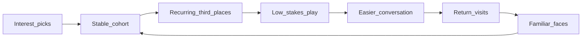

# Community, play, and competitive landscape

Product research for Common Area: why strangers become a cohort, how play and third places compound over a season, and how we differentiate from facilitator-style social apps. This document is **strategy canon** alongside [PRODUCT_PLAN.md](./PRODUCT_PLAN.md); implementation details live in [GAMIFICATION.md](./GAMIFICATION.md) and [DATA_MODEL.md](./DATA_MODEL.md).

## North star

Common Area helps a small group of Chicago Gen Z adults turn a handful of local third places into a **campus common room** over one season—using light play to make talking easy, **repetition** to make people familiar, and **hosts** to make the city feel knowable.

The name **Common Area** is the strategy: **area** (neighborhood rooms, routes, corners) plus **common** (shared ritual, overlap, return). We are not selling another optimized first encounter with strangers; we are selling **membership in a small world**.

## What Gen Z is asking for (2025–2026 signals)

Young adults report loneliness while planning **more** in-person experiences—the gap is **repeatable structure**, not another one-off ticket.

| Signal | Implication for Common Area |
|--------|-----------------------------|
| **Reset to real** — intent to attend more live experiences while seeking authentic connection | Seasonal commitment and recurring cohort rhythm, not infinite event browsing |
| **Fourth spaces** — passion-led communities moving from online interest into small recurring gatherings | Cohorts anchored in **chosen activities**, not generic “social events” |
| **Authenticity over curation theater** — appetite for experiences that feel less produced | Low-pressure prompts; play where conversation is not the only activity |
| **Hyperlocal belonging** — desire to feel tied to a neighborhood, not only the whole city | Host businesses as **campus buildings**; prompts scoped to cohort geography |
| **Third-place hunger** — loss of post-college “automatic” community | Recurring presence at the same rooms with the same faces |
| **Play as community glue** — adult communities of play build connection through shared activity, not networking performance | Gamification as **social lubricant**, not XP grind |

### Sources

- [Eventbrite — “Reset to real” / social study (2026 press)](https://www.eventbrite.co.uk/blog/press/newsroom/eventbrites-inaugural-social-study-report-reveals-the-reset-to-real-how-gen-z-and-millennials-are-redefining-live-experiences-in-2026/)
- [Eventbrite — Fourth spaces (PDF, Jan 2025)](https://www.eventbrite.com/blog/wp-content/uploads/2025/01/Eventbrite-_-Fourth-Spaces-_-Jan.-2025.pdf)
- [HuffPost — Gen Z and third spaces](https://www.huffpost.com/entry/third-spaces-and-gen-z_l_675ca0fee4b0a6324e3b58ad)
- [Greater Good — When adults embrace play, they create community](https://greatergood.berkeley.edu/article/item/when_adults_embrace_play_they_create_community)
- [First Monday — Third places and Gen Z in a mobile game (cross-national)](https://firstmonday.org/ojs/index.php/fm/article/view/13850) — “leveler” (shared footing among participants) correlates with well-being

## Competitors: what they optimize (and where they stop)

Social **facilitators** are a crowded category. Both major comparables excel at **the first hour**; neither optimizes **encounter four through twelve** at the same hosts with the same cohort.

### 222

- **Job:** Curated in-person evenings with matched strangers—personality and interests inform invitations; users say yes and show up to planned group experiences.
- **Strengths:** Strong city-as-playground story, vetted participants, anti-endless-scroll positioning, Gen Z word-of-mouth in target cities including Chicago.
- **Ceiling:** Episodic magic; matching remains **opaque curation of who**; venues are backdrop for a planned night, not a season-long common room.
- **References:** [222.place](https://222.place/), [how 222 works (overview)](https://soren.social/how-222-works), [Eater review](https://www.eater.com/dining-out/945137/222-social-app-review)

### Timeleft

- **Job:** Weekly ritual (often Wednesday dinners)—no swiping, logistics handled, small groups at restaurants, large geographic scale.
- **Strengths:** Repeatable cadence, low planning burden, friendship framing, operational proof at scale.
- **Ceiling:** Facilitator-as-product; rotating groups; venue as reservation slot, not cohort-owned map; compatibility matching stays opaque.
- **References:** [Timeleft](https://timeleft.com/), [about](https://timeleft.com/about/)

### Category pattern vs Common Area

| Facilitator apps | Common Area (target) |
|------------------|----------------------|
| Optimize **first encounter** | Optimize **encounters 4–12** |
| **Event** or **weekly slot** | **Season + stable cohort (~15–20)** |
| Matching as **magic** | **User picks + visible overlap** (best-effort ≥2 shared activity types) |
| City **consumption** | Neighborhood **membership** |
| Business as **vendor** | Business as **host / common room** (consumer-first now; partner surface later) |

## Common Area wedge: anti-algorithm, pro-continuity

**Anti-algorithm** means rejecting opaque compatibility scores and infinite optimization—not rejecting structure. Structure **is** the product:

- User-chosen interests (four of six) → cohorts with legible overlap.
- Seasonal deposit → permission to invest in one arc.
- Fixed cohort size → enough variety, small enough for recognition.
- Recurring host businesses → the **area** becomes navigable (“our table,” “our corner”).

### Two-sided story (later)

Hosts should gain **predictable repeat traffic** and community-shaped regulars, not a one-off promo blast. Members should feel **recognized at places**—the opposite of anonymous reservation slots. See **Host partners (future)** in [DATA_MODEL.md](./DATA_MODEL.md). Do not ship host product until the consumer season loop proves retention.

## Core product: onboarding is infrastructure, play is the unlock

Onboarding (discover season → sign up → deposit → four picks → assignment → reveal) must be durable and demo-ready. It is **not** the emotional core.

The core product is **repeat encounters**: same cohort, same neighborhood rooms, light play that makes talking easy until strangers become familiar faces. Chat, prompts, presence, and host rituals exist to **lower the cost of the next conversation**, not to maximize card completion.

## Bingo and gamification: foundation, not ceiling

Today `/bingo` combines **season signup** (four experiences + deposit) with **post-assignment bonus tiles**. The card metaphor fits the brand (bulletin board, stamps, campus energy) but fails if completion is mostly solo taps.

[GAMIFICATION.md](./GAMIFICATION.md) sketches prompts, streaks, cohort challenges, business quests, presence, and achievements. Product direction:

| Layer | Role | Examples |
|-------|------|----------|
| **Ritual** | Shared rhythm | Weekly “common hour,” host office hours, cohort poll for which room |
| **Recognition** | Familiarity | Name prompts; host shout-outs for regulars |
| **Co-presence** | Place + people | Soft “others from your cohort are here” (opt-in, not competitive GPS) |
| **Collaboration** | Cohort acts together | Group quest at one business; cohort progress meter |
| **Discovery** | Area literacy | Hyperlocal prompts tied to chosen activity types |
| **Archive** | Season memory | Polaroids, quotes, “places we kept returning to” |

**Evolution**

1. **Onboarding card** — keep: four picks, deposit, envelope ritual.
2. **Season card** (post-assignment) — socially legible prompts: who, where, low-pressure; conversation starters, not homework.
3. **Host card** (later) — businesses publish standing cohort-friendly rituals.
4. **Cohort ledger** — season story (returns, co-visits); warmth over leaderboard.

**Anti-patterns:** XP grind, shame for non-participation, punishing streaks, dating-interview prompts, cross-cohort leaderboards, performative content tasks.

## Format experiments (learn by talking to people)

Treat formats as **season experiments**. Run 4–6 week micro-pilots with one friendly cohort per format; kill or merge quickly.

**Weekly cadence (template)**

- **Monday:** one open question in cohort chat.
- **Midweek:** optional common hour at one host (same time weekly).
- **Weekend:** one play-leaning prompt (walk, craft, game night)—socializing not the only activity.

**Formats to test (priority order)**

1. Name + place recognition — learn three names; return twice to one host with a cohort member.
2. Cohort micro-challenges — four people same night at one host; **cohort** progress bar.
3. Conversation scaffolding — rotating Crumbs prompts in chat and IRL; opt-in voice or photo **at the place**.
4. Host rituals — recurring slot (“Thursdays are vinyl night”) as cohort campus hour.
5. Season scavenger (area-only) — clues across cohort picks’ geography.
6. Rotating low-stakes roles — greeter, playlist, snack (campus club energy).
7. Spontaneous moments — time-boxed nudges when optional co-presence overlaps.

**Interview script (15 minutes, after any touchpoint)**

- Did you see someone again? Would you recognize them on the street?
- Did any place feel “yours”? Would you go back without the app?
- What felt cringe vs easy?
- Did anything feel like dating, networking, or homework?
- What would you do weekly if we stopped nudging?

**Promote a format when:** unprompted return to the same host with cohort mentions in chat; cross-member threads (not only bot replies); “I’d come back next season” without a discount.

## Metrics that measure community (not vanity)

De-emphasize raw bingo completion as the north star. Prefer:

- Repeat co-attendance at the same host with another cohort member.
- Unique host return visits per member per season.
- Cohort reply depth and cross-member threads in chat.
- Pairwise familiarity proxies (name prompts acknowledged, optional recognition completions).
- Cohort retention week over week through the season.

Keep operational metrics (deposit conversion, assignment completion) as **funnel** health, not **community** health.

## What we must not become

- Another Wednesday-dinner brand with a bingo skin.
- Compatibility mystique or swipe-adjacent UX.
- Citywide infinite events marketplace.
- Gamification that punishes introverts or busy schedules.
- Hosts as disposable backdrop—without repeat cohort traffic at businesses, the “area” story is only marketing.

## Related documents

- [PRODUCT_PLAN.md](./PRODUCT_PLAN.md) — MVP journey and constraints
- [GAMIFICATION.md](./GAMIFICATION.md) — schema and API sketch
- [DESIGN_SYSTEM.md](./DESIGN_SYSTEM.md) — warm campus common room tone
- [DATA_MODEL.md](./DATA_MODEL.md) — persistence and host-partner stub
